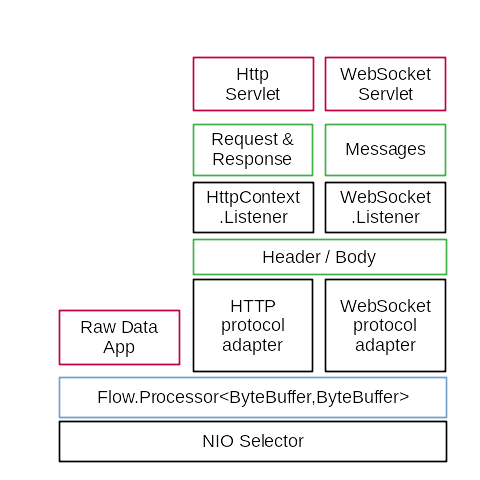

# nate
A complement to the jdk HttpClient; i.e., an HttpServer with an api designed around the reactive-streams specification as implemented by java.util.concurrent.Flow.

So far only it's just the main api is here.  It borrows mostly from java.net.http.HttpClient with some concepts and terminology from javax.xml.ws.Endpoint (that used to be in the jre).

Here's a diagram how (I think) it works: 

